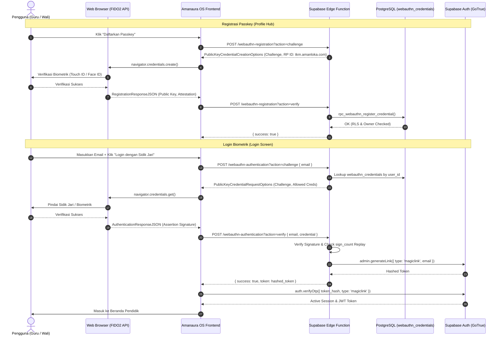

# ADR-05: Passkey (WebAuthn / FIDO2) Biometric Authentication

**Status**: RATIFIED (ARB SEALED)  
**Date**: 2026-09-02  
**Sprint**: #DW-02 (Passkey WebAuthn Integration)  
**Governing Standard**: LEVEL 2 — MASTER SPECIFICATION  
**Relying Party ID**: `tkm.amanloka.com`  
**Canonical Production Origin**: `https://tkm.amanloka.com`

---

## 1. Context & Motivation

Autentikasi berbasis kata sandi memiliki kerentanan mendasar:
1. **Phishing & Man-in-the-Middle (MitM)**: Kata sandi rentan disadap atau diserahkan pengguna ke situs tiruan.
2. **Kelelahan Kata Sandi (Password Fatigue)**: Pendidik dan orang tua sering melupakan kata sandi kompleks, menghambat alur kerja harian sekolah.
3. **Penyusupan Kredensial (Credential Stuffing)**: Kebocoran kata sandi dari platform pihak ketiga membahayakan akun pengguna.

Standar **Passkey (FIDO2 / WebAuthn)** menyediakan paradigma autentikasi modern:
- **Tahan Phishing (Phishing-Resistant)**: Kriptografi asimetris berbasis pasangan kunci publik/privat yang terikat erat (*domain-bound*) pada domain resmi `tkm.amanloka.com`.
- **Biometrik Perangkat Asli**: Menggunakan Touch ID, Face ID, Windows Hello, atau sensor sidik jari Android langsung dari chip keamanan perangkat (*Secure Enclave / TPM*).
- **Nol Transmisi Rahasia**: Kunci privat tidak pernah meninggalkan perangkat pengguna dan tidak pernah dikirimkan ke server.

---

## 2. Arsitektur & Tumpukan Teknologi



### 2.1 Pustaka Resmi
- **Server Verification Engine**: `@simplewebauthn/server` (v13.3.3) — Pengurai COSE Key, verifikasi tanda tangan kriptografis, dan penghitung attestation.
- **Browser Ceremony Engine**: `@simplewebauthn/browser` (v13.3.0) — Wrapper typed aman untuk `navigator.credentials.create()` dan `navigator.credentials.get()`.

---

## 3. Skema Basis Data & RLS Isolation

### 3.1 Tabel `webauthn_credentials`
```sql
CREATE TABLE IF NOT EXISTS webauthn_credentials (
  credential_id text PRIMARY KEY,
  user_id uuid NOT NULL REFERENCES auth.users(id) ON DELETE CASCADE,
  public_key bytea NOT NULL,
  sign_count bigint NOT NULL DEFAULT 0,
  transports text[] DEFAULT '{}',
  device_type text CHECK (device_type IN ('platform', 'cross-platform')),
  friendly_name text,
  created_at timestamptz NOT NULL DEFAULT now(),
  last_used_at timestamptz
);
```

### 3.2 Keamanan Berlapis (Defense-in-Depth RLS)
- **Select Policy**: `Users can view own credentials` (`auth.uid() = user_id`).
- **Mutation Isolation**: Mutasi insert/delete/update dikunci melalui 5 Security Definer RPCs dengan validasi `auth.uid()` mutlak:
  1. `rpc_user_has_passkey() -> boolean`
  2. `rpc_user_passkey_count() -> integer`
  3. `rpc_list_user_passkeys() -> TABLE(...)`
  4. `rpc_delete_user_passkey(target_credential_id text) -> void`
  5. `rpc_webauthn_register_credential(...) -> void`

---

## 4. Pagar Keamanan Tingkat Tinggi (ARB Security Shields)

### 4.1 Deteksi Serangan Replay & Kredensial Kloning (*Sign Count Replay Defense*)
Setiap autentikasi berhasil mengekstrak `newCounter` dari assertion hardware. Jika `newCounter <= storedCredential.sign_count` pada nilai counter non-nol, server mendeteksi anomali kredensial terkopi (*cloned passkey attack*). Kredensial yang terkompromi langsung **dihapus/dibatalkan** dan mengembalikan error `CREDENTIAL_COMPROMISED`.

### 4.2 Pencegahan Enumerasi Akun (*User Enumeration Prevention*)
Saat inisiasi challenge autentikasi di Edge Function, jika email tidak ditemukan atau belum mendaftarkan passkey, server **dilarang** mengembalikan pesan spesifik `USER_NOT_FOUND`. Server selalu merespons dengan pesan generik konstan:
`"INVALID_CREDENTIALS: Email tidak terdaftar atau passkey belum diaktifkan"`.

### 4.3 Penyaringan Transport Berdasarkan Perangkat (*Transport Filtering*)
Pada perangkat mobile (Android / iOS / iPadOS), server memprioritaskan kredensial biometrik internal (`transports: ['internal']` atau `device_type: 'platform'`) agar dialog WebAuthn tidak memicu pop-up Bluetooth/USB yang membingungkan.

### 4.4 Heuristik Nama Perangkat (*Device Friendly Name*)
Aplikasi secara otomatis mendeteksi model perangkat pengguna (`Apple iPhone 15`, `Samsung (SM-X710)`, `Windows PC (Windows Hello)`, `Mac (Touch ID)`) agar pengguna dapat mengidentifikasi dan mengelola perangkat terdaftar dengan mudah di modal `PasskeyManager`.

---

## 5. Strategi Pembentukan Sesi (*Session Creation Strategy*)

Supabase Auth GoTrue tidak mengizinkan pembuatan sesi sembarangan melalui service role token. Setelah assertion biometrik diverifikasi oleh Edge Function:
1. Edge Function memanggil `supabase.auth.admin.generateLink({ type: 'magiclink', email })`.
2. Hashed token yang aman dan berumur pendek dikembalikan ke klien frontend.
3. Klien frontend mengonsumsi token tersebut secara instan via `supabase.auth.verifyOtp({ token_hash, type: 'magiclink' })`, menginisialisasi sesi autentikasi Supabase sah secara native.

---

## 6. Dukungan Peramban & Fallback

| Browser / Platform | Dukungan Platform Authenticator |
|---|---|
| **Google Chrome (Android / Desktop)** | ✅ Chrome 92+ (Fingerprint / Face / Screen Lock) |
| **Apple Safari (iOS / iPadOS / macOS)** | ✅ Safari 14.5+ (Touch ID / Face ID) |
| **Mozilla Firefox** | ✅ Firefox 122+ |
| **Microsoft Edge** | ✅ Edge 92+ (Windows Hello) |

*Catatan Fallback*: Jika perangkat atau browser tidak mendukung WebAuthn, form login tetap menyediakan alur standar masuk menggunakan kata sandi (*Graceful Degradation*).

---

---

## 8. Addendum: Bootstrap Direct Registration Mode & ARB Threat Model (W-18 s.d. W-21)

Dalam situasi di mana Edge Functions belum terdeploy ke infrastruktur cloud, sistem menyediakan jalur registrasi biometrik langsung (*Bootstrap Direct Registration Mode*) dengan pengerasan keamanan ketat yang disahkan oleh ARB:

### 8.1 Model Ancaman & Batas Keamanan (*Threat Model*)
1. **Owner-Only Isolation**: RPC registrasi `rpc_webauthn_register_credential` berjalan di bawah kendali `auth.uid()`. Penyerang terautentikasi hanya memiliki radius dampak pada akun miliknya sendiri (*self-account blast radius*).
2. **Kunci Publik Non-Rahasia**: Penyimpanan public key dari klien bersifat publik dan bukan rahasia.

### 8.2 Pengerasan Terverifikasi (W-18, W-20)
* **Server-Issued Challenge (W-18)**: Challenge registrasi wajib diterbitkan oleh server melalui RPC `rpc_webauthn_registration_challenge()` (berlaku 5 menit, *single-use*).
* **Validasi Upacara di Server (W-18)**: Server memverifikasi `client_data_json->>'type' = 'webauthn.create'`, origin yang diizinkan (`https://tkm.amanloka.com`), dan kesesuaian challenge.
* **Credential Cap (W-20)**: Setiap pengguna dibatasi maksimal 5 passkey terdaftar (`CREDENTIAL_LIMIT_REACHED`).

### 8.3 Garis Merah Autentikasi (W-19)
> **Verifikasi assertion TIDAK BOLEH pernah terjadi di klien.**  
> Jika Edge Function `webauthn-authentication` tidak terjangkau, login passkey jatuh lembut (*graceful fallback*) ke pesan *"Login biometrik belum tersedia — silakan masuk menggunakan kata sandi"*. Klien **dilarang keras** membuat sesi atau memalsukan verifikasi tanda tangan tanpa persetujuan server.

### 8.4 Checklist Deploy Kanonikal Edge Functions
```bash
# Registrasi (JWT Verified)
supabase functions deploy webauthn-registration

# Autentikasi (No Verify JWT — Anon Pre-Auth)
supabase functions deploy webauthn-authentication --no-verify-jwt
```

---

*Disahkan secara konstitusional oleh Architecture Review Board (ARB) pada 2 September 2026 (Ratifikasi Tambahan W-18 s.d. W-21).*
