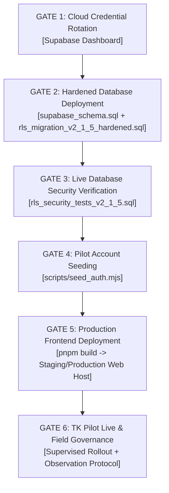
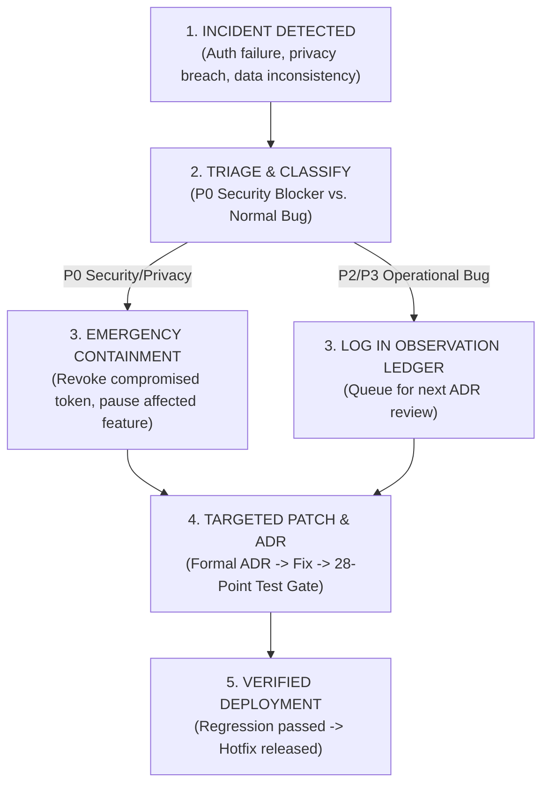
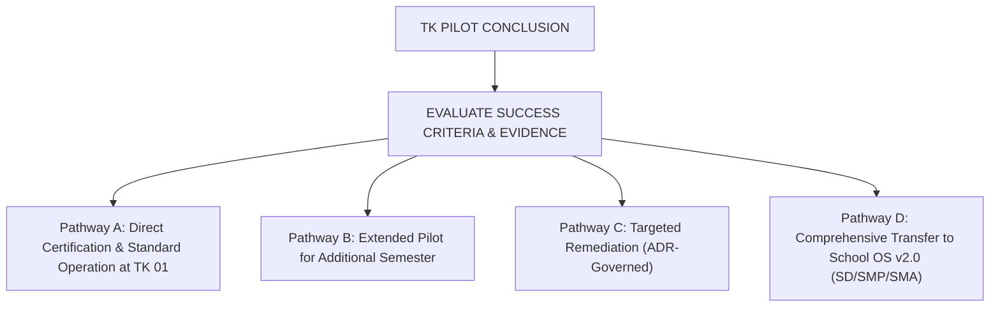

# YAPENDIK SCHOOL OS — TK PILOT v1.0
# OPERATIONAL DEPLOYMENT & ACCEPTANCE PLAN

**Document ID:** `YAPENDIK-OPS-DEPLOY-TK-2026-001`  
**Governance Authority:** Yapendik OS Constitution & Architecture Review Board  
**Authoritative Implementation Baseline:** V2.1.5 Definitive Production Baseline  
**Auditor & Architect Roles:** Senior Release & Operational Governance Architect  
**Effective Date:** 2026-08-25  
**Version:** 1.0 (Operational Bridge Edition)  

---

```
════════════════════════════════════════════════════════════════════════════════
                      YAPENDIK SCHOOL OS (TK PILOT v1.0)
                  OPERATIONAL DEPLOYMENT & ACCEPTANCE PLAN
════════════════════════════════════════════════════════════════════════════════

  Implementation Status : 🔒 FROZEN PILOT BASELINE (V2.1.5 Definitive)
  Governance Status     : Yapendik OS Constitution — LIVING / ACTIVE GOVERNANCE
  Engineering Baseline  : ✅ CERTIFIED (28/28 Regression Tests, Zero Lint Errors)
  Target Stage          : Operational Deployment & Supervised Pilot Execution

────────────────────────────────────────────────────────────────────────────────
OPERATIONAL MISSION:
Safely bridge the certified engineering baseline into live school operations,
execute controlled deployment gates, observe field workflows, and collect
empirical evidence for future Yapendik School OS (v2.0) expansion.
════════════════════════════════════════════════════════════════════════════════
```

---

## 1. Executive Summary

The engineering remediation and security hardening phase of **Yapendik School OS — TK Pilot v1.0** is officially concluded. With the definitive **V2.1.5 Definitive Production Baseline** certified across 28 automated test scenarios (20 runtime behavioral and 8 SQL contract tests) and clean production bundle builds, the software artifact is formally frozen.

This document defines the **Operational Deployment & Acceptance Plan**. It establishes the exact operational protocol for cloud credential rotation, physical database deployment, live security testing, pilot user provisioning, staging/production frontend release, role-based acceptance testing (UAT), and field observation governance.

---

## 2. Purpose

The purpose of this operational plan is to:
1. **Bridge Engineering to Operations:** Transition the certified software baseline from repository development into real-world school deployment without introducing unauthorized architecture drift.
2. **Enforce Deployment Gating:** Mandate sequential execution of six verified operational gates prior to live user onboarding.
3. **Establish Field Observation Protocols:** Provide structured mechanisms to capture pedagogical insights, usability friction, and workflow mismatches during the pilot without triggering premature code modifications.
4. **Govern Change Control:** Enforce formal Architectural Decision Records (ADRs) for any subsequent system modification.

---

## 3. Scope

This plan strictly governs the deployment, verification, operation, and acceptance of **TK Pilot v1.0** at the pilot institution (**TK Yapendik 01 / Maranatha**):
- **Target Platforms:** Supabase PostgreSQL Cloud, Node.js runtime scripts, and Vite React Web Application (`dist/`).
- **Target Personas:** Yayasan Superadmin, Headmaster, Homeroom Teachers, Assistant Teachers, Administrative Staff, and Guardians.
- **Constitutional Boundary:** Preserves all 19 Master Governance Specifications under [`doc/MASTER/`](file:///d:/PROJECT/yapendik-tk-pilot/doc/MASTER).
- **Out of Scope:** Structural code redesigns, enterprise feature expansions, or multi-unit SD/SMP/SMA rollouts (reserved for School OS v2.0).

---

## 4. Governance Authority

The deployment and operation of Yapendik School OS is governed by the constitutional hierarchy:

$$\text{Yapendik OS Constitution (Doc 01)} \longrightarrow \text{Domain/Entity Spec (Doc 08/12)} \longrightarrow \text{Authorization Model (Doc 10)} \longrightarrow \text{V2.1.5 Hardened Database} \longrightarrow \text{Operational Plan}$$

- **Constitutional Principle 1 (Living Governance):** The Yapendik OS Constitution remains a living, active framework for the long-term educational foundation.
- **Constitutional Principle 2 (Frozen Pilot Implementation):** The TK Pilot v1.0 software implementation is frozen. No ad-hoc or unreviewed code changes are permitted during the operational rollout.

---

## 5. Current Baseline Status

| Parameter | Certified Value / Artifact | Status |
|---|---|---|
| **Software Baseline** | Yapendik School OS — TK Pilot v1.0 | 🔒 **FROZEN PILOT BASELINE** |
| **Database Baseline** | V2.1.5 Definitive Production Baseline | 🔒 **FROZEN** ([`db_migrations/rls_migration_v2_1_5_hardened.sql`](file:///d:/PROJECT/yapendik-tk-pilot/db_migrations/rls_migration_v2_1_5_hardened.sql)) |
| **Certification Status** | `🟢 CERTIFIED — PRODUCTION READY FOR TK PILOT` | ✅ **APPROVED** ([`doc/MASTER/FINAL_PRODUCTION_CERTIFICATION.md`](file:///d:/PROJECT/yapendik-tk-pilot/doc/MASTER/FINAL_PRODUCTION_CERTIFICATION.md)) |
| **Independent Audit** | Zero P0/P1 code blockers; operational preconditions identified | ✅ **ARCHIVED** ([`doc/MASTER/FINAL_INDEPENDENT_SECURITY_AUDIT.md`](file:///d:/PROJECT/yapendik-tk-pilot/doc/MASTER/FINAL_INDEPENDENT_SECURITY_AUDIT.md)) |
| **Automated Regression** | 28 / 28 Tests Passed (20 Runtime Behavioral + 8 SQL Contract) | ✅ **PASSING** (`pnpm test`) |
| **Typecheck & Build** | TypeScript (`tsc --noEmit`): 0 errors; Vite Build: Clean | ✅ **PASSING** (`pnpm lint`, `pnpm build`) |
| **Governance Status** | Yapendik OS Constitution | 🟢 **LIVING / ACTIVE GOVERNANCE** |

---

## 6. Engineering Exit $\longrightarrow$ Operational Entry

$$\begin{array}{|c|}
\hline
\textbf{ENGINEERING PHASE (CONCLUDED)} \\
\text{Remediation } \rightarrow \text{ V2.1.5 Hardening } \rightarrow \text{ Automated Regression (28/28) } \rightarrow \text{ Independent Security Audit} \\
\hline
\end{array}$$
$$\Downarrow$$
$$\begin{array}{|c|}
\hline
\textbf{BASELINE FREEZE GATE (LOCKED)} \\
\text{Codebase Frozen } \rightarrow \text{ No Informal Refactoring } \rightarrow \text{ Living Constitution Acknowledged} \\
\hline
\end{array}$$
$$\Downarrow$$
$$\begin{array}{|c|}
\hline
\textbf{OPERATIONAL DEPLOYMENT PHASE (ACTIVE)} \\
\text{Cloud Credential Rotation } \rightarrow \text{ DB DDL Deployment } \rightarrow \text{ Live SQL Verification } \rightarrow \text{ Seed Auth } \rightarrow \text{ Frontend Deploy} \\
\hline
\end{array}$$
$$\Downarrow$$
$$\begin{array}{|c|}
\hline
\textbf{TK PILOT LIVE & FIELD GOVERNANCE} \\
\text{Supervised Pilot Onboarding } \rightarrow \text{ Empirical Observation } \rightarrow \text{ ADR & School OS v2.0 Transfer} \\
\hline
\end{array}$$

---

## 7. Operational Deployment Principles

1. **No Informal Code Changes:** Code is never modified on the deployment server or in the repository without a formal ADR.
2. **Evidence-Driven Gates:** No deployment gate may be marked complete without documented cryptographic, terminal, or UI evidence.
3. **Least Privilege & Credential Hygiene:** The `service_role` key and database passwords are restricted strictly to administrative deployment scripts and never exposed to client browsers or source control.
4. **Live Boundary Verification:** SQL security suites must be executed against the live cloud instance to prove PostgreSQL enforcement prior to end-user onboarding.
5. **Role-Based Acceptance:** UAT is performed independently for each of the 6 institutional roles.
6. **Empirical Field Observation:** The pilot is an observational learning environment to evaluate real workflow alignment, not an ad-hoc feature factory.

---

## 8. Operational Deployment Sequence (The Six Gates)



---

## 9. Gate 1 — Cloud Credential Rotation

- **Gate ID:** `GATE-01-CRED-ROTATION`
- **Objective:** Eliminate risk from legacy development credentials previously stored in local development files ([`.env.supabase`](file:///d:/PROJECT/yapendik-tk-pilot/.env.supabase)).
- **Preconditions:** Access to the official Supabase Cloud Project Dashboard for the Yapendik TK Pilot.
- **Action Steps:**
  1. Log in to Supabase Cloud Dashboard $\rightarrow$ Project Settings $\rightarrow$ Database.
  2. Execute **Reset Database Password**; record the new strong secret in institutional password vault.
  3. Navigate to Project Settings $\rightarrow$ API $\rightarrow$ JWT / Secret Keys.
  4. Rotate the `service_role` key and generate fresh Project API Keys.
  5. Update the deployment environment configuration ([`.env.local`](file:///d:/PROJECT/yapendik-tk-pilot/.env.local)) locally without staging or committing it to Git.
  6. Confirm that old credentials fail with `401 Unauthorized` on connection attempts.
- **Evidence Required:** Screenshot / log of successful credential rotation; validation that local connection uses fresh credentials.
- **Responsible Role:** Security Architect / Cloud Database Administrator.
- **Rollback / Failure Condition:** If rotation interrupts connection, re-verify project URL and newly generated tokens.
- **Status:** ☐ **NOT STARTED (OPERATOR ACTION REQUIRED)**

---

## 10. Gate 2 — Hardened Database Deployment

- **Gate ID:** `GATE-02-DB-DEPLOYMENT`
- **Objective:** Deploy canonical schema and hardened V2.1.5 RLS policies to the live PostgreSQL cloud database.
- **Preconditions:** Gate 1 completed; active `DATABASE_URL` configured in deployment environment.
- **Execution Sequence:**
  1. **Pre-Deployment Safety:** Confirm target database instance is clean or perform full logical backup:
     ```powershell
     # If existing data exists, create backup
     pg_dump "$DATABASE_URL" > backup_pre_pilot_$(Get-Date -Format 'yyyyMMdd_HHmmss').sql
     ```
  2. **Deploy Physical Schema:**
     ```powershell
     # Execute canonical physical schema
     $env:DATABASE_URL="<SECURE_DATABASE_URL>"
     node scripts/run_schema.mjs
     ```
  3. **Deploy Hardened V2.1.5 RLS Migration:**
     Apply [`db_migrations/rls_migration_v2_1_5_hardened.sql`](file:///d:/PROJECT/yapendik-tk-pilot/db_migrations/rls_migration_v2_1_5_hardened.sql) via Supabase SQL Editor or `psql`:
     ```powershell
     psql "$DATABASE_URL" -f db_migrations/rls_migration_v2_1_5_hardened.sql
     ```
- **Evidence Required:** SQL output confirming execution with 0 errors, 15 tables with RLS enabled, 6 RPC functions compiled, 2 triggers attached (`trg_student_placement_guard`, `trg_report_published_immutability`), and constraint `uq_daily_attendance_record` established.
- **Responsible Role:** Database Administrator / Release Engineer.
- **Rollback Condition:** Execute `ROLLBACK;` transaction block if script fails; inspect syntax or constraint errors.
- **Status:** ☐ **NOT STARTED (OPERATOR ACTION REQUIRED)**

---

## 11. Gate 3 — Live Database Security Verification

- **Gate ID:** `GATE-03-LIVE-SECURITY-VERIFY`
- **Objective:** Execute authoritative negative security tests directly against live cloud PostgreSQL to prove that RLS boundaries cannot be bypassed.
- **Preconditions:** Gate 2 completed; target database populated with schema and hardened migration.
- **Action Steps:**
  1. Execute [`db_migrations/rls_security_tests_v2_1_5.sql`](file:///d:/PROJECT/yapendik-tk-pilot/db_migrations/rls_security_tests_v2_1_5.sql) against live PostgreSQL:
     ```powershell
     psql "$DATABASE_URL" -f db_migrations/rls_security_tests_v2_1_5.sql
     ```
  2. Confirm that all 8 negative test assertions execute and pass:
     - `TEST 1: DIRECT-MUTATION -> FAIL` (direct UPDATE of `current_class_id` rejected by trigger).
     - `TEST 2: TRUSTED-RPC -> PASS & UNAUTHORIZED -> FAIL` (teacher cannot place student, headmaster can).
     - `TEST 3: CROSS-STUDENT / IDOR -> FAIL` (`rpc_save_progress_report_draft` blocks student ID tampering).
     - `TEST 4: CLOSED-AY -> FAIL` (cannot save report for inactive academic year).
     - `TEST 5: PUBLISHED -> IMMUTABLE` (UPDATE/DELETE on PUBLISHED report blocked).
     - `TEST 6: DIRECT AUDIT INSERT -> FAIL` (direct table insert into `audit_logs` rejected).
     - `TEST 7: CROSS-SCHOOL ATTENDANCE -> FAIL` (cross-school actor cannot read/write).
     - `TEST 8: GUARDIAN CONFIDENTIAL OBSERVATION LEAK -> FAIL` (guardian cannot view confidential records).
- **Evidence Required:** Terminal execution log showing `TEST PASSED` for all 8 live scenarios.
- **Responsible Role:** Security Reviewer / Independent Auditor.
- **Rollback Condition:** If any negative test passes an illegal operation, immediately pause deployment and investigate policy definitions.
- **Status:** ☐ **NOT STARTED (OPERATOR ACTION REQUIRED)**

---

## 12. Gate 4 — Pilot Authentication Account Seeding

- **Gate ID:** `GATE-04-PILOT-AUTH-SEED`
- **Objective:** Provision authenticated user accounts in Supabase Auth and link them to canonical `persons` records via `user_person_identities`.
- **Preconditions:** Gate 3 completed; `SUPABASE_SERVICE_ROLE_KEY` and strong `PILOT_SEED_DEFAULT_PASSWORD` configured.
- **Action Steps:**
  1. Set environment parameters and execute [`scripts/seed_auth.mjs`](file:///d:/PROJECT/yapendik-tk-pilot/scripts/seed_auth.mjs):
     ```powershell
     $env:VITE_SUPABASE_URL="https://<project-id>.supabase.co"
     $env:SUPABASE_SERVICE_ROLE_KEY="<ROTATED_SERVICE_ROLE_KEY>"
     $env:PILOT_SEED_DEFAULT_PASSWORD="<STRONG_COMPLEX_PASSWORD>"
     node scripts/seed_auth.mjs
     ```
  2. Verify that accounts are created for all 6 institutional personas:
     - `user_superadmin_yapendik` $\rightarrow$ Andreas Hendrawan (`YAPENDIK_SUPERADMIN`)
     - `user_headmaster_esther` $\rightarrow$ Esther Nugroho (`HEADMASTER` - TK 01)
     - `user_teacher_siti` $\rightarrow$ Siti Rahmawati (`TEACHER` - TK A)
     - `user_teacher_maria` $\rightarrow$ Maria Magdalena (`TEACHER` - TK B)
     - `user_teacher_diana_tk2` $\rightarrow$ Diana Sari (`TEACHER` - TK 02 Multi-School Isolation)
     - `user_parent_budi` $\rightarrow$ Budi Santoso (`GUARDIAN` - Kenzo)
  3. Validate deterministic fixture baseline via [`db_migrations/pilot_seed_v2_1_5.sql`](file:///d:/PROJECT/yapendik-tk-pilot/db_migrations/pilot_seed_v2_1_5.sql).
- **Evidence Required:** Terminal output confirming `User identities successfully linked in user_person_identities table!`
- **Responsible Role:** Identity Administrator / Release Engineer.
- **Status:** ☐ **NOT STARTED (OPERATOR ACTION REQUIRED)**

---

## 13. Gate 5 — Production Frontend Deployment

- **Gate ID:** `GATE-05-FRONTEND-DEPLOY`
- **Objective:** Build and deploy the production web application bundle to the hosting environment.
- **Preconditions:** Gate 4 completed; automated regression suite verified clean.
- **Action Steps:**
  1. Execute pre-deployment regression check:
     ```powershell
     pnpm lint
     pnpm test
     ```
     *(Must confirm 28/28 tests passed with 0 errors)*.
  2. Execute production bundle build:
     ```powershell
     pnpm build
     ```
  3. Verify output bundle in `dist/` (`dist/index.html`, `dist/assets/*`).
  4. Deploy `dist/` to the production web hosting service (Vercel / Cloudflare Pages / Static Web Server).
  5. Configure production environment variables (`VITE_SUPABASE_URL`, `VITE_SUPABASE_ANON_KEY`).
  6. Perform initial post-deployment smoke test (page load, HTTPS validation, asset delivery).
- **Evidence Required:** Deployment URL, successful HTTP 200 response, browser console with 0 network or uncaught syntax errors.
- **Responsible Role:** Release Engineer / Frontend Lead.
- **Status:** ☐ **NOT STARTED (OPERATOR ACTION REQUIRED)**

---

## 14. Gate 6 — TK Pilot Live & Field Governance

- **Gate ID:** `GATE-06-PILOT-GO-LIVE`
- **Objective:** Officially open the application for supervised pilot use at TK Yapendik 01.
- **Preconditions:** Gates 1 through 5 completed and accepted; UAT completed; operational runbook distributed to school staff.
- **Action Steps:**
  1. Issue individual credentials securely to pilot participants.
  2. Conduct on-site orientation for Headmaster Esther and Teachers (Siti & Maria).
  3. Enable daily operational logging and field observation capture.
  4. Transition project status to **TK PILOT LIVE (OBSERVATIONAL ENVIRONMENT)**.
- **Evidence Required:** Formal pilot launch sign-off by Yapendik Foundation and School Leadership.
- **Responsible Role:** Yapendik OS Project Lead / School Headmaster.
- **Status:** ☐ **NOT STARTED (OPERATOR ACTION REQUIRED)**

---

## 15. Role-Based Operational Acceptance Test (UAT Matrix)

The following acceptance matrix must be executed and signed off during Gate 5/6:

| Persona & Role | Test Scenario | Acceptance Criteria | Verified Result | Sign-Off |
|---|---|---|---|---|
| **YAPENDIK_SUPERADMIN**<br/>(Dr. Andreas Hendrawan) | Cross-school supervisory review & database settings | Can view foundation-wide data; can access Supabase settings modal; cannot perform direct pedagogical edits in closed AY. | ☐ PASS / FAIL | `[ ]` |
| **HEADMASTER**<br/>(Dra. Esther Nugroho) | Student placement & LPPA report review/approval/publish | Can assign student to class (`cls_tka_01`); can approve `READY_FOR_REVIEW` reports; can publish report; published report becomes immutable. | ☐ PASS / FAIL | `[ ]` |
| **TEACHER**<br/>(Siti Rahmawati - TK A) | Daily attendance, observation, and progress draft | Can record attendance for TK A with idempotent updates; can save anecdotal observation; can draft LPPA report and submit for review; blocked from approving own report. | ☐ PASS / FAIL | `[ ]` |
| **TEACHER (Cross-School)**<br/>(Diana Sari - TK 02) | Multi-school tenant isolation | Attempt to view or create records in TK 01 is blocked immediately with `DENY_CROSS_SCHOOL` / RLS denial. | ☐ PASS / FAIL | `[ ]` |
| **GUARDIAN**<br/>(Budi Santoso - Parent of Kenzo) | Single-family child privacy & observation view | Can log in and view Kenzo's attendance and shared observations; staff-confidential observations are excluded; cannot view other students. | ☐ PASS / FAIL | `[ ]` |
| **STAFF**<br/>(Administration) | Operational recording | Can view attendance register; blocked from creating pedagogical observations or approving development reports. | ☐ PASS / FAIL | `[ ]` |

---

## 16. Pilot Field Observation Protocol

During the live pilot, the application functions as an **Observational Learning Environment**. All user interactions, feedback, and friction points must be recorded systematically using the classification schema below:

### Finding Classification Schema

| Category Code | Classification | Description & Action Boundary |
|---|---|---|
| **CAT-A** | **BUG** | Unintended technical error, UI crash, or failed state transition (requires patch under Change Control). |
| **CAT-B** | **SECURITY / PRIVACY ISSUE** | Critical access boundary defect or information leakage (triggers immediate incident protocol). |
| **CAT-C** | **UX FRICTION** | Clunky interaction, button confusion, or input latency that slows down teacher workflow. |
| **CAT-D** | **WORKFLOW MISMATCH** | Discrepancy between software process and actual daily school operational habits. |
| **CAT-E** | **DATA MODEL GAP** | Missing field or entity relationship required by school administration. |
| **CAT-F** | **REPORTING / INFORMATION GAP** | Required government / yayasan format not fully addressed by LPPA output. |
| **CAT-G** | **PEDAGOGICAL INSIGHT** | Observations on child developmental progress tracking and Kurikulum Merdeka alignment. |
| **CAT-H** | **GOVERNANCE INSIGHT** | Policy gaps regarding authority, approval thresholds, or institutional custody. |
| **CAT-I** | **FUTURE SCHOOL OS (v2.0)** | High-value capability identified for multi-unit (SD/SMP/SMA) scaling. |

### Field Observation Capture Template

```markdown
### FIELD OBSERVATION RECORD: [OBS-YYYYMMDD-XXX]
- **Date & School Unit:** YYYY-MM-DD | TK Yapendik 01
- **Actor Persona:** [Teacher / Headmaster / Guardian / Staff]
- **Workspace Context:** [Observation / Attendance / Development / Enrollment]
- **Observed Workflow:** [Brief description of what user was doing]
- **Expected Behavior:** [What user or governance expected to happen]
- **Actual Behavior:** [What actually occurred in UI / Data layer]
- **Finding Classification:** [CAT-A through CAT-I]
- **Operational Urgency:** [P0 Blocker / P1 High / P2 Medium / P3 Low]
- **Architectural Impact:** [Requires ADR / No ADR Needed / Post-Pilot Input]
- **Evidence / Screenshot:** [Reference to screenshot, console log, or audit log ID]
- **Recommendation:** [Proposed resolution for pilot or v2.0 roadmap]
```

---

## 17. Incident & Security Response Protocol

If an unexpected operational failure or security event occurs during the pilot:



- **Severity Levels:**
  - **P0 (Emergency Security / Privacy Incident):** Unintended data leak or authorization failure. Operator must pause the affected workspace, rotate credentials, and notify the Architecture Review Board within 1 hour.
  - **P1 (Operational Workflow Blocker):** Attendance or report submission completely blocked. Resolve within 24 hours via emergency change procedure.
  - **P2 / P3 (Minor UX or Data Discrepancy):** Logged in observation ledger and evaluated during weekly review.

---

## 18. Formal Change Control Procedure

Because the **TK Pilot implementation baseline is FROZEN**, no ad-hoc code modification is permitted. Any proposed change must strictly follow this lifecycle:

$$\text{Field Observation / Finding (CAT-A/B)} \longrightarrow \text{Impact Analysis} \longrightarrow \text{Formal ADR (doc/ADR/)} \longrightarrow \text{Targeted Code Fix} \longrightarrow \text{28-Point Regression Gate} \longrightarrow \text{Certification Stamp}$$

### Requirements for Change Approval:
1. **Architectural Review:** Proposed modification must not violate the Yapendik OS Constitution.
2. **Regression Verification:** Full test suite ([`tests/run_all_tests.ts`](file:///d:/PROJECT/yapendik-tk-pilot/tests/run_all_tests.ts)) must achieve **100% pass rate**.
3. **Audit Ledger Update:** Document change in [`doc/MASTER/FINAL_INDEPENDENT_SECURITY_AUDIT.md`](file:///d:/PROJECT/yapendik-tk-pilot/doc/MASTER/FINAL_INDEPENDENT_SECURITY_AUDIT.md).

---

## 19. Operational Evidence & Audit Ledger

The deployment team must maintain the following execution ledger across all gates:

| Gate ID | Target Date | Operator | Environment | Verification Method | Result | Reviewer Status | Reference / Proof |
|---|---|---|---|---|---|---|---|
| `GATE-01` | *Pending* | Cloud DBA | Supabase Cloud | API key reset & connection test | ☐ PENDING | ☐ AWAITING | Rotation Log # |
| `GATE-02` | *Pending* | Database Eng | PostgreSQL Live | DDL execution output | ☐ PENDING | ☐ AWAITING | Migration DDL Log # |
| `GATE-03` | *Pending* | Security Lead | PostgreSQL Live | `rls_security_tests_v2_1_5.sql` | ☐ PENDING | ☐ AWAITING | SQL Test Log # |
| `GATE-04` | *Pending* | Identity Admin | Supabase Auth | `scripts/seed_auth.mjs` | ☐ PENDING | ☐ AWAITING | Auth User IDs List |
| `GATE-05` | *Pending* | Release Eng | Staging/Prod Host | `pnpm test && pnpm build` | ☐ PENDING | ☐ AWAITING | Build Artifact Hash |
| `GATE-06` | *Pending* | Project Lead | TK Yapendik 01 | Formal Launch Checklist | ☐ PENDING | ☐ AWAITING | Launch Sign-Off # |

---

## 20. Pilot Success Criteria

The pilot phase will be evaluated against objective multi-dimensional success criteria:

### Technical Success Criteria
- **Zero Critical Security Defects:** Zero data leakage across school units or unauthorized guardian data exposure.
- **Database Integrity:** Zero duplicated attendance records; 100% immutability adherence on published progress reports.
- **System Availability:** 99.5% uptime during school operational hours (07:00 – 16:00 WIB).

### Operational Success Criteria
- **Attendance Adoption:** Daily attendance recorded digitally by homeroom teachers with 100% completion rate.
- **Observation Velocity:** Minimum of 2–3 pedagogical observations recorded per student weekly.
- **Report Cycle Completion:** 100% of Semester 1 LPPA progress reports successfully drafted, reviewed by Headmaster, and published to parents.

### UX & Pedagogical Success Criteria
- **Teacher Daily Workflow:** Core attendance and daily notes take $\le 5$ minutes per classroom per day.
- **Guardian Engagement:** Parents able to review developmental narratives and attendance without administrative assistance.

### Institutional Success Criteria
- **Governance Codification:** Foundation leadership gains real-time visibility into student safety, health status, and class capacities.
- **Empirical Gap Analysis:** Complete documentation of operational mismatches to inform School OS v2.0 design.

---

## 21. Pilot Review Cadence

```
Rollout Day 1–7      : Daily 15-minute operational sync with Headmaster & Teachers
Week 2 – Month 1     : Weekly observation review & finding classification meeting
Month 2 (Mid-Pilot)  : Mid-term governance review & ADR evaluation
Month 4 (End-Pilot)  : Final LPPA report cycle audit & pilot conclusion review
```

---

## 22. Pilot Exit Criteria & Transition Pathways

At the conclusion of the pilot semester, the Architecture Review Board will select one of the following transition pathways based on empirical evidence:



---

## 23. Knowledge Transfer $\longrightarrow$ Yapendik School OS v2.0

$$\text{TK Pilot v1.0 (Field Evidence)} \xrightarrow{\text{Empirical Synthesis}} \text{Living Constitution Evolution} \xrightarrow{\text{Enterprise Blueprint}} \text{Yapendik School OS v2.0}$$

1. **Empirical Grounding:** Future enterprise architecture for Primary (SD), Junior High (SMP), and Senior High (SMA) must be based on real operational evidence collected during this pilot, not abstract assumptions.
2. **Domain Model Refinement:** Any domain gaps identified under CAT-E/CAT-F will be formally integrated into Master Governance Documents [`08`](file:///d:/PROJECT/yapendik-tk-pilot/doc/MASTER/08-YAPENDIK%20SCHOOL%20OS%20TK%20PILOT%20%E2%80%94%20SPESIFIKASI%20DOMAIN%20&%20ENTITAS.md) through [`16`](file:///d:/PROJECT/yapendik-tk-pilot/doc/MASTER/16-YAPENDIK%20SCHOOL%20OS%20TK%20PILOT%20API%20&%20APPLICATION%20CONTRACT.md).
3. **Enterprise RLS Scaling:** Database multi-tenancy validated in TK Pilot will serve as the architectural template for the 25+ institution Yapendik foundation network.

---

## 24. Final Operational Handover Checklist

The following checklist governs final release clearance:

```
[X] 1. Engineering implementation baseline frozen (V2.1.5 Definitive)
[X] 2. Automated regression pipeline passing (28/28 tests passed)
[X] 3. TypeScript compilation & Vite production build clean (0 errors)
[X] 4. Independent Security Audit and Certification documents archived
[X] 5. Operational Deployment & Acceptance Plan established (Doc YAPENDIK-OPS-DEPLOY-TK-2026-001)
[ ] 6. Gate 1: Cloud credentials rotated in Supabase Dashboard
[ ] 7. Gate 2: Schema and hardened V2.1.5 migration executed on target DB
[ ] 8. Gate 3: Live PostgreSQL negative security test suite passed
[ ] 9. Gate 4: Production authentication accounts seeded securely
[ ] 10. Gate 5: Production web application bundle deployed and verified
[ ] 11. Role-Based Operational Acceptance Test (UAT) completed
[ ] 12. Operational incident protocol active and team assigned
[ ] 13. Gate 6: Supervised TK Pilot officially opened for live operations
```

---

## 25. Final Governance Declaration

> **"Yapendik School OS — TK Pilot v1.0 is hereby formally transferred from the Engineering Phase into the Operational Deployment and Supervised Pilot Phase.**
> 
> **The V2.1.5 implementation baseline remains FROZEN.**  
> **The Yapendik OS Constitution remains LIVING / ACTIVE GOVERNANCE.**  
> 
> **All future modifications are strictly governed by formal Change Control and Architectural Decision Records (ADRs). The TK Pilot shall operate as a controlled field-learning environment whose empirical evidence will guide the future expansion of the Yapendik School OS enterprise."**

---
*Certified & Approved for Operational Execution,*  
**Yapendik OS Architecture Review Board & Release Governance Council**
